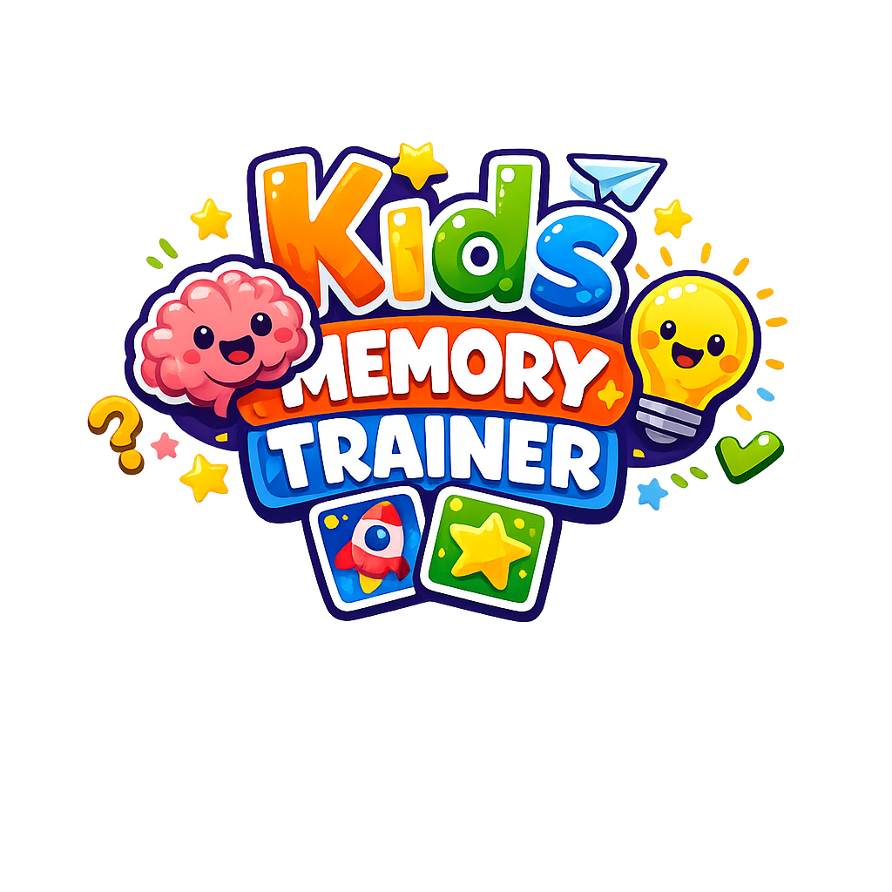

# macOS Memory Game

A kid-friendly memory matching game built with Flutter for macOS.



## Features

- Single-player time trial with local best times.
- Local two-player hotseat mode.
- Grid sizes from 4x4 up to 12x12.
- Theme choices for animals, numbers, letters, and colors.
- Custom image assets for card faces.
- Emoji, number, letter, and color fallbacks when custom images are missing.
- Local leaderboards saved with `shared_preferences`.
- Animated 3D card flips.

## Requirements

- macOS
- Flutter SDK `3.3.0` or newer
- Xcode with macOS desktop build tools

Check your setup with:

```bash
flutter doctor
```

If macOS desktop support is not enabled:

```bash
flutter config --enable-macos-desktop
```

## Run The App

From the project folder:

```bash
flutter pub get
flutter run -d macos
```

## Custom Card Assets

The game can use images from the `assets` folder before falling back to built-in symbols.

Asset folders:

```text
assets/animals/
assets/numbers/
assets/letters/
assets/colors/
```

Add image files to the folder for the theme you want to customize. For example:

```text
assets/animals/1.png
assets/animals/2.png
assets/animals/3.png
assets/numbers/1.png
assets/letters/a.png
```

Supported image formats:

```text
.png .jpg .jpeg .webp .gif .avif
```

Recommended image size:

```text
512 x 512 px PNG
```

Square images work best. Transparent PNGs are a good choice because the card color can still show around the image. Larger images such as `1024 x 1024 px` are also fine, but they will be scaled down inside the card.

### Fallback Behavior

Each board needs one unique face per pair.

Examples:

- A `4x4` board needs 8 unique faces.
- A `6x6` board needs 18 unique faces.
- A `12x12` board needs 72 unique faces.

If a theme folder has enough images, the game uses those images. If it does not have enough images, the remaining pairs use fallback content:

- Animals use emoji.
- Numbers use numbers.
- Letters use letters.
- Colors use generated card colors.

So if `assets/animals/` has 12 images and the player starts a `6x6` game, the first 12 pairs use images and the remaining 6 pairs use animal emoji.

After adding new assets, run:

```bash
flutter pub get
```

Then restart the app.

## Project Structure

```text
lib/main.dart                         App entry point
lib/screens/main_menu.dart            Main menu and game setup
lib/screens/game_screen.dart          Game board screen
lib/widgets/memory_card.dart          Card UI and flip animation
lib/models/game_state.dart            Game rules and state
lib/services/theme_asset_service.dart Asset folder loading
lib/services/storage_service.dart     Local leaderboard storage
assets/                              Custom card images
images/                              README and app images
```

## Test And Analyze

Run these before building a release:

```bash
flutter analyze
flutter test
```

## Build A Final macOS App

Create a release build:

```bash
flutter build macos --release
```

The built app will be here:

```text
build/macos/Build/Products/Release/memory_game.app
```

You can open it directly from Finder, or run:

```bash
open build/macos/Build/Products/Release/memory_game.app
```

To make a zip file that is easier to share:

```bash
ditto -c -k --sequesterRsrc --keepParent build/macos/Build/Products/Release/memory_game.app memory_game-macos.zip
```

The zip file will be created at:

```text
memory_game-macos.zip
```

### Sharing Outside Your Mac

For personal use, the release `.app` is usually enough.

For sharing with other people, macOS may warn that the app is from an unidentified developer unless it is signed and notarized with an Apple Developer account. For wider distribution, update the bundle identifier in:

```text
macos/Runner/Configs/AppInfo.xcconfig
```

Then build, sign, and notarize the app using Apple tooling.

## GitHub Release Builds

This project includes a GitHub Actions workflow that builds a downloadable macOS app when you push a release tag.

Tag format:

```text
v*
```

Examples:

```text
v1.0.0
v1.1.0
v2.0.0-beta.1
```

To create and push a release tag:

```bash
git tag v1.0.0
git push origin v1.0.0
```

GitHub Actions will then:

- install Flutter
- run `flutter analyze`
- run `flutter test`
- build the macOS release app
- package `memory_game.app` into a zip file
- upload the zip to the GitHub Release

The release download will be named like:

```text
memory_game-macos-v1.0.0.zip
```

The workflow file is:

```text
.github/workflows/macos-release.yml
```

You can also run the workflow manually from the GitHub Actions tab. Manual runs upload the zip as a workflow artifact, but only tag builds upload the zip to a GitHub Release.

## Tech Stack

- Flutter
- Dart
- `shared_preferences` for local leaderboard persistence
- `uuid` for card IDs
- Flutter `ChangeNotifier` for game state

## License

This project is licensed under the Apache License 2.0. See [LICENSE](LICENSE).
